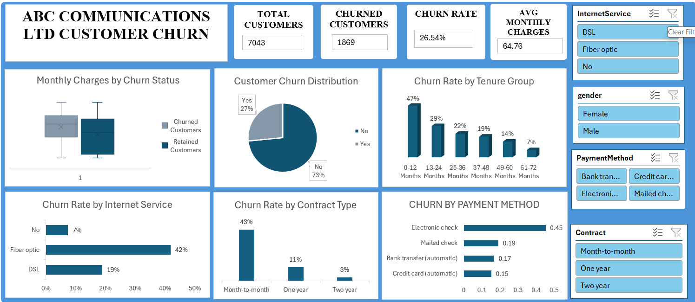

# Telco-customer-churn-analysis
Excel based customer churn analysis project examining customer retention, churn drivers, service usage, contract type, tenure and payment methods.
# Telco Customer Churn Analysis

## Project Overview

This project analyzes customer churn for a telecommunications company using Microsoft Excel.

The objective is to identify key factors influencing customer churn and provide actionable recommendations to improve customer retention.

## Business Questions

- What does the customer base look like?
- Which customer segments have the highest churn?
- Does contract type influence retention?
- Does tenure affect customer loyalty?
- Which services influence churn?
- Which payment methods have higher churn?
- What actions should management take?

## Tools Used

- Microsoft Excel
- PivotTables
- PivotCharts
- Slicers
- Conditional Formatting
- Data Visualization
- Correlation Analysis

## Key Analysis

The analysis examines:

- Customer churn rate
- Contract type
- Customer tenure
- Internet service
- Payment method
- Monthly charges
- Total charges
- Customer demographics

##Dashboard

## Key Findings

- Overall customer churn is approximately 27%.
- Month-to-month customers have substantially higher churn than customers on longer-term contracts.
- Customers with shorter tenure are more likely to churn.
- Electronic check customers show relatively high churn.
- Fiber optic customers have relatively high churn.

## Recommendations

1. Develop retention strategies for month-to-month customers.
2. Introduce incentives for customers to move to longer-term contracts.
3. Strengthen onboarding and engagement during the first year.
4. Investigate issues affecting fiber-optic customers.
5. Develop targeted retention campaigns for high-risk customer segments.

## Deliverables

- Excel Dashboard
- Business Understanding Report
- Dataset Inspection Report
- Data Visualizations
- Insights and Recommendations
- Presentation
